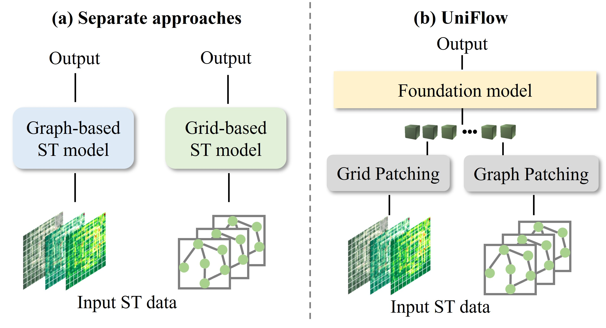

# UniFlow

This is the official implementation of our paper: **A Foundation Model for Unified Urban Spatio-Temporal Flow Prediction**.

-----

The repo currently includes code implementations for the following tasks:

> **Short-term Prediction**: We provide the script  for the reproduction of short-term prediction results in this repo.

> **Long-term Prediction**: We provide the script  for the reproduction of long-term prediction results in this repo.


## Introduction
By unify different types of spatio-temporal flow data, including grid-based data and graph-based data, we build **UniFlow**, a foundation model for general urban spatio-temporal flow prediction. 


## Overall Architecture
UniFlow consists of three main parts: (i) spatio-temporal patching, (ii) sequential modeling with transformers, and (iii) spatio-temporal memory retrieval augmentation. 


## Data
We use multiple datasets to demonstrate the effectiveness of UniFlow. To access the datasets, please refer to [data readme](https://github.com/YuanYuan98/KDD25-submission-78/blob/main/dataset/UniFlow_dataset/README.md).


## ⚙️ Installation
### Environment
- Tested OS: Linux
- Python >= 3.9
- torch == 2.0.0
- Tensorboard

### Dependencies:
1. Install Pytorch with the correct CUDA version.
2. Use the `pip install -r requirements.txt` command to install all of the Python modules and packages used in this project.

## Model Training

Please first navigate to the `src` directory by using the cd command: `cd src`

Then please create a folder named `experiments_all` to record the training process: `mkdir experiments_all`


We provide the scripts under the folder `./scripts/`. You can train UniFlow with the TaxiBJ13 dataset as the following examples:

```python
python main.py --device_id 2 --machine machine  --t_patch_size 16  --his_len 64 --pred_len 64  --dataset TaxiBJ13_48  --used_data 'GridGraphall'   --num_memory 512   --prompt_content 'node_graph'   --size middle --batch_ratio 0.1
```

Once your model is trained, you will find the logs recording the training process in the  `./logs_all/` directory. The folder will be named as the `Size_<model_size>_Dataset_<dataset>_PType_<prompt>_his_<history length>_pred_<prediction horizon>_UseData_<training data>_<device name>`. In the `./experiments_all/Exp/Size_<model_size>_Dataset_<dataset>_PType_<prompt>_his_<history length>_pred_<prediction horizon>_UseData_<training data>_<device name>/model_save/`, you will find the trained model named `model_best.pkl`.

In our experiments, we leverage different types of flow datasets to enhance UniFlow, including multiple grid-based data and multiple graph-based data. 
If you need to use multiple datasets, please use an asterisk (*) to separate the datasets, *e.g.*, `--dataset GraphSH_28_96*FlowSH_7_96*GraphBJ_28_96*TaxiBJ13_48*GraphNJ_28_96*TaxiNYCIn_48*TaxiNYCOut_48*CrowdBJ_24*PopSH_24*CrowdNJ_24 `.

There are some new parameters to specify:

- `his_len` specifies the input sequence length.
- `pred_len` specifies the prediction horizon.
- `num_memory` specifies the number of embeddings in the memory.
- `prompt_content` specifies the type of prompt, which can be selected from ['node','graph','node_t','node_f','graph_t','graph_f'].

The evaluation results of the testing set can be obtained from `./experiments_all/Exp/Size_<model_size>_Dataset_<dataset>_PType_<prompt>_his_<history length>_pred_<prediction horizon>_UseData_<training data>_<device name>/result.txt`.
